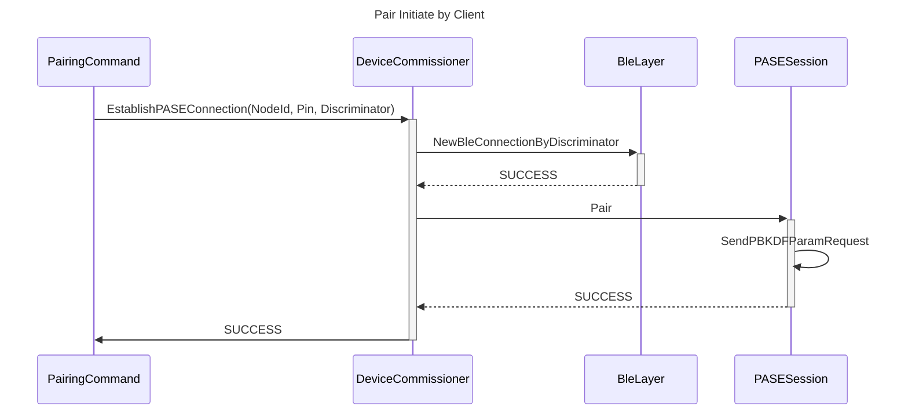
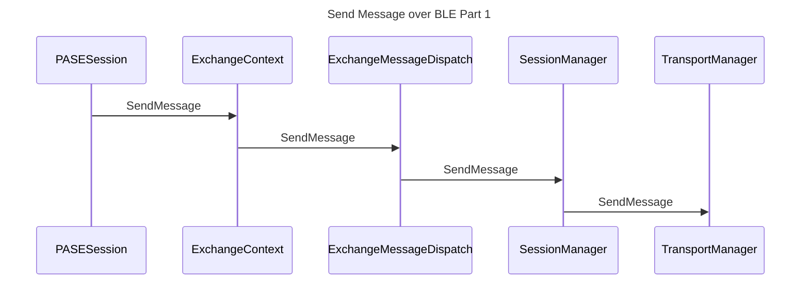
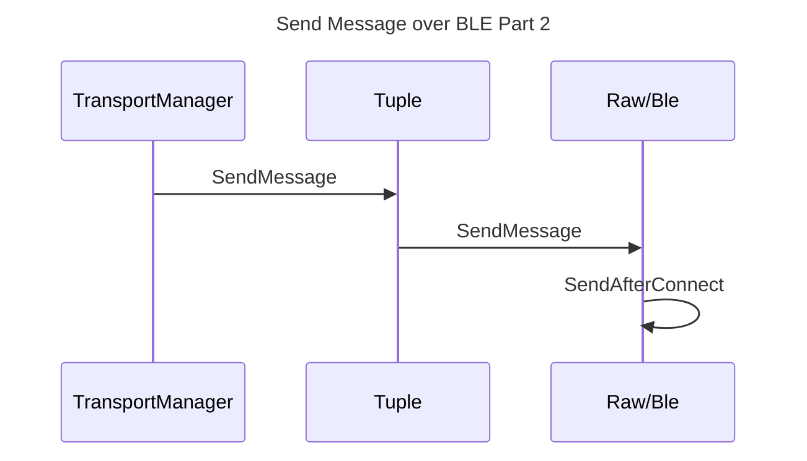
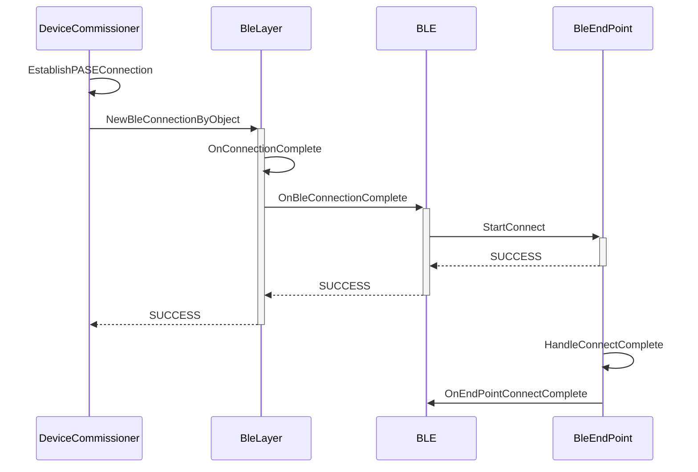
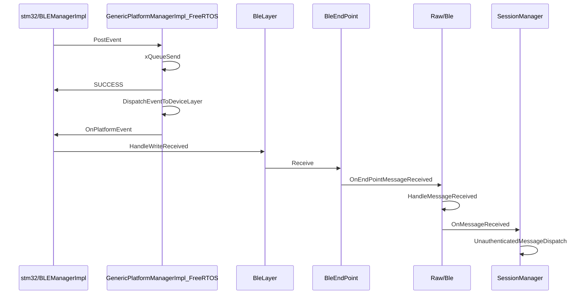
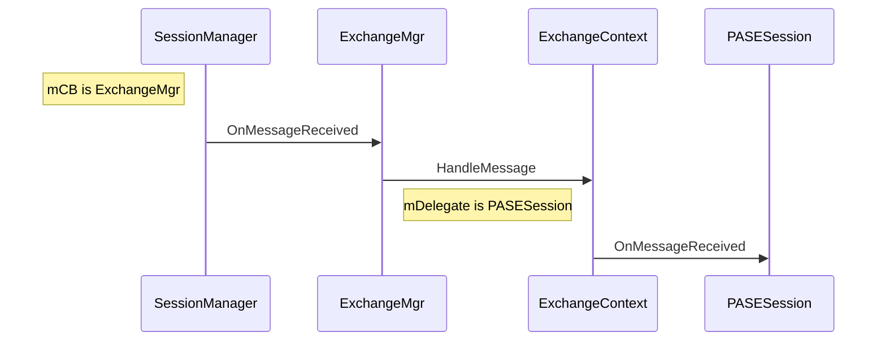
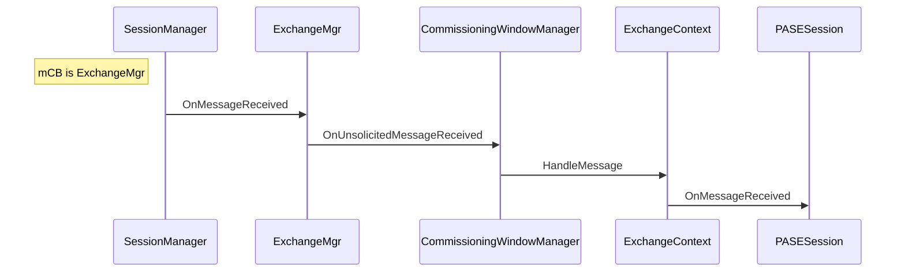

# Commission Sequence Diagram
I remember how exciting I was when I first finished the commission process of the lock example with the python controller on the Thread network running on the Resbarry PI.

Back in that time, there is no official document or SDK page, all I have is the source code and github PRs. And I really ran into so many problems during the commission process, even the README is not correct.

A lot of time, I have to search the source code from `main()` and skipped over tons of lines of code to find where I am in the commission process and look for what I want. At the meanwhile, I got to try understanding the whole provision process like when to turn BLE on, how the device gets into the Thread network, etc.

So, a nice sequence diagram with the source code notation would be a great perspective to understand the whole picture of this project.

## A BLE message

Before we start to work on the commission process, it will be helpful for us to understand how a typical BLE message is sending and receiving because this is the bus where the first message is running on.

In addition, after the commission is completed, the subsequent commnuication using UDP/TCP share similar Matter transport stack, so it is pretty worth to have a look right now.

## Sending
To simpify the explanation and make it easy to understand, let's start with the ChipTool which is a CHIP client running on Linux.

In the readme of ChipTool, it suggests us to commission the device with
`./chip-tool pairing ble-wifi <node_id> <ssid> <password> <pin_code> <discriminator>`
where
>`<node_id>` is the user-defined ID of the node being commissioned.
>`<ssid>` and `<password>` are credentials determined in the step 3.
>`<pin_code>` and `<discriminator>` are device-specific keys determined in the step 5.

You can find more detail on how to use chip tool at the official SDK [HERE](https://project-chip.github.io/connectedhomeip-doc/development_controllers/chip-tool/chip_tool_guide.html).


### The Fist Command: Pair
The chip-tool utilizes command pattern, so if we would like to find some command, we can go directly to the `examples/chip-tool/commands/` folder.

In our case, we want to track down how the pair is working, so `pairing/PairingCommand.cpp` if the file to find how the commission process starts. That has been said, PairingCommand is the start point of the sequence diagram.


The PBKDFParamRequest is exactly the first message of the commission handshake. One thing worth to be noted is that the SendPBKDFParamRequest is actually a async function. It is sending the PBKDFParamRequest to the BLE TX queue and this TX queue will be cleaning up afte the BLE connection is estibalished.

If we dig into the SendPBKDFParamRequest function, we can see this flow:

:::info
I break down the flow into two diagrams for better reading. Also, in this diagram, all function call is blocking call function, and I will not add the "SUCCESS" return arror to keep the diagram clean.
:::




Again, in the last function call, the Raw/BLE.cpp just put the message into the TX queue so that the BLE stack can send it out later.

### BLE Connection
So, next the question is when exactly the message would be sent out?

Let's start with this function: NewBleConnectionByDiscriminator

In this function, we can easily find that there is a success callback OnDiscoveredDeviceOverBleSuccess passed down in the NewBleConnectionByDiscriminator call. And this is a great start point of the flow chart, so here is how it looks like of sequence chart starting at OnDiscoveredDeviceOverBleSuccess.



In OnEndPointConnectComplete, BleLayer will send the pending buffer which includes the message the SendAfterConnect pushed previous.

So now we get to know how the 2 parties pair up in BLE and start the very first message after running the pair command from commissioner point of view.

Next, we will have a look at how commissioner receive a message from the server.

## Buttom Up
Let's start with stm32(the rest platform should follow the similar process). First at all, we find how the stm32 device init the BLE receive callback in the `platform/stm32/BLEManagerImpl.cpp::_Init()`
```c++
APP_MATTER_BLE_Set_Receive_Callback(HandleRXCharWrite);
```

So we will start the sequence diagram in the function HandleRXCharWrite




So the above sequence diagrams conver how a typical message being translating between server and client for very first message of commission by BLE from client side.

For the server side, the sequence becomes slightly different.



The CommissioningWindowManager would setup the PASESession to the ExchangeContext as its delegate.

