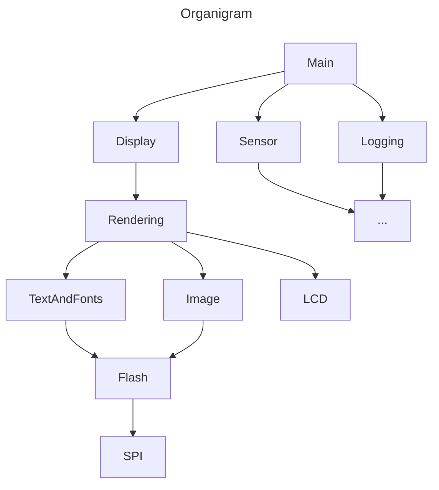

# Debug
When setting a break point, there are 2 typical way to do that
1. Changed the code directly before loading it to flash
2. If the system is running outside of flash, then, there will be some register to be used to store the breaking point address. And the system(or debugger?) has to compare the address everytiem when it advance the PC point(I guess?)

# Challanges
1. Crossing compile and debugger
2. Bring out unit, which mixes hardware and software issue
3. Manufactor
4. Remote debug for shipped unit
5. Changes among the developement cycle

# Some Design Principles
* Modularity
* Test it
* Documenting as you can understand your code 1 year later
* Don't try to optomize everything. Make it work, test and do optomize

# Design Architecture
## How We Start
* From blank state
* Starting from existed project
## Design From Different Directions
1. The HW is fixed, we design the software to meet the HW
2. The features(software) design first, and pick the correct HW to meet the SW

## Diagrams
This book suggests to use diagrams to start our system design because we will have more reliable code if we can better understand of the whole design.

The following diagram should be design by order

### Context Diagram
It's actually the user story

### Block Diagram
This diagram will usually start from the HW block diagram. Each HW component will also become an indenpendt SW block. After that we should add more component(box) to the diagram for thing like:
* HW driver like bus driver(SPI, UART), GPIO, clock.
* Contoller for driver(more like high level driver), namingly, Flash, LED, Logging, Sensor.

Basically, just add SW individual component as many as possible at this stage. We can go back and do some optomization by group boxes.

### Organigram
A top down organizational chart like diagram. It typcially starts with main and goes down along with the calling stack.

Here is an example

### Layer Diagram
The last diagram we should use is layer diagram with the following rules:
1. Start from bottom.
2. Each block(component) will touch the component the it will interact with.
3. The size of the block represents it's complexity.

:::info
Because of the point(2), the more a component is being used by other component the bigger it will become.

This is matched with point(3) because when a component is shared among mulitple component the chance is that it would become more complicated
:::

With this diagram, we can have a better view to think about if we can merge some components, which touch the exactly same components. Or, when a component is getting too big, we may think about how to saperate it into two parts.
