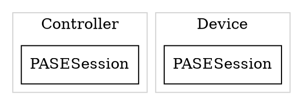
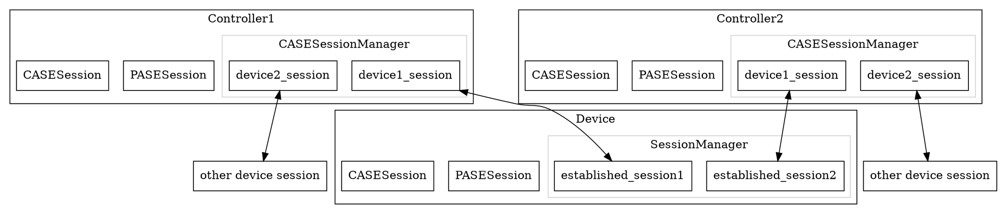

# Session and EC

###### tags: `CHIP` `Matter` `Firmware` `Engineer`

> 2022/06/05
> CHIP git hash code 67b4746ad8

## How message goes

Following the calling stack of sending/receiving message line by line gives us a very basic idea of how the message being handled.

However, we will have a better understanding of this project if we take a look from structure point of view.

So, I would like to put down some note about these two classes:
Seesion and ExchangeContext.

## Sessions in PASE

The very first step to connect to the device is this command like this:
```shell=
connect -ble 3840 20202021 1234
```

After BLE connection, both controller and device have a PASE session object ready for the incoming PASE handshaking. In the controller, the PASESession is in CommissioneeDeviceProxy. This class is just like what its name suggests, namely, controller uses it as a device proxy representing the devcie it is going to commit.

On the device, we can find the PASESession in CommissioningWindowManager.

Here we have:

Nonetheless, if we follow the calling stack of receiving message, we will notice that PASESession is not the session the CHIP stack uses to talk to each other.
In the SessionManager::MessageDispatch, we can find this:
```cpp=
Optional<Transport::UnauthenticatedSessionHandle> optionalSession = mUnauthenticatedSessions.FindOrAllocateEntry(peerAddress, gDefaultMRPConfig);
/*
 * something else
 */
mCB->OnMessageReceived(packetHeader, payloadHeader, SessionHandle(session), peerAddress, isDuplicate, std::move(msg)); 
```
The peerAddress is bypassed by
```cpp=
/* in BLEBase::OnEndPointMessageReceived */
HandleMessageReceived(Transport::PeerAddress(Transport::Type::kBle), std::move(buffer));
```
As you can see, the session being bypassed to the upper layer is a session object called UnauthenticatedSessionHandle.

So, where is PASESesion?

It turns out that PASESession is more like a state machine which handle the entire PASE handshaking.

**And after the PASE is finished, the CHIP stack will create a security session by the PASESession and free the PASEsession for next possible PASE request.** Also, the CHIP stack could find this secursity session by peer  Node ID or peer session ID later on.

For example, in CHIPDeviceController.cpp we have this:
```cpp=1006
CHIP_ERROR err = mSystemState->SessionMgr()->NewPairing(mDeviceBeingCommissioned->GetSecureSessionHolder(), Optional<Transport::PeerAddress>::Value(pairing->GetPeerAddress()),pairing->GetPeerNodeId(), pairing, CryptoContext::SessionRole::kInitiator, mFabricIndex);
```
Although it doesn't show the session ID, the "NewPairing" will actually read the peer session ID and the local session from the pairing object.

After that, both controller and device will reset some objects so that they could accept next PASE request.

But, what exactly are session ID and Node ID?

### Session ID
Session ID is the ID generated by the CHIP stack, it should come with a session object(unauthenticated or authenticated) and should be unique on controller/device.

On controller side, we can find it in EstablishPASEConnection at CHIPDeviceController.cpp (keyID = session ID):
```cpp=842
 session = mSystemState->SessionMgr()->CreateUnauthenticatedSession(params.GetPeerAddress(), device->GetMRPConfig());
    VerifyOrExit(session.HasValue(), err = CHIP_ERROR_NO_MEMORY);

    exchangeCtxt = mSystemState->ExchangeMgr()->NewContext(session.Value(), &device->GetPairing());
    VerifyOrExit(exchangeCtxt != nullptr, err = CHIP_ERROR_INTERNAL);

    err = mIDAllocator.Allocate(keyID);
    SuccessOrExit(err);

    // TODO - Remove use of SetActive/IsActive from CommissioneeDeviceProxy
    device->SetActive(true);

    /* 
     * If you check the API of Pair, you will see the third parameter is called sessionID
     */
    err = device->GetPairing().Pair(params.GetPeerAddress(), params.GetSetupPINCode(), keyID,
                                    Optional<ReliableMessageProtocolConfig>::Value(mMRPConfig), exchangeCtxt, this);
```
For device, we can also find session ID in OpenCommissioningWindow at CommissioningWindowManager.cpp (again, keyID = sessionID)
```cpp=161
    ReturnErrorOnFailure(mIDAllocator->Allocate(keyID));

    mPairingSession.Clear();
    ReturnErrorOnFailure(mPairingSession.MessageDispatch().Init(&mServer->GetSecureSessionManager()));

   ...

    if (mUseECM)
    {
        ReturnErrorOnFailure(SetTemporaryDiscriminator(mECMDiscriminator));
        ReturnErrorOnFailure(
            mPairingSession.WaitForPairing(mECMPASEVerifier, mECMIterations, ByteSpan(mECMSalt, mECMSaltLength), mECMPasscodeID,
                                           keyID, Optional<ReliableMessageProtocolConfig>::Value(gDefaultMRPConfig), this));

        // reset all advertising, indicating we are in commissioningMode
        app::DnssdServer::Instance().StartServer(Dnssd::CommissioningMode::kEnabledEnhanced);
    }
    else
    {
        uint32_t pinCode;
        ReturnErrorOnFailure(DeviceLayer::ConfigurationMgr().GetSetupPinCode(pinCode));

        ReturnErrorOnFailure(mPairingSession.WaitForPairing(
            pinCode, kSpake2p_Iteration_Count,
            ByteSpan(reinterpret_cast<const uint8_t *>(kSpake2pKeyExchangeSalt), strlen(kSpake2pKeyExchangeSalt)), keyID,
            Optional<ReliableMessageProtocolConfig>::Value(gDefaultMRPConfig), this));

        // reset all advertising, indicating we are in commissioningMode
        app::DnssdServer::Instance().StartServer(Dnssd::CommissioningMode::kEnabledBasic);
    }
```

In the above code, the session ID is stored in the PASESession at first, and the CHIP stack will copy this session ID from PASESession to the secruity session just like what I memtion above.

### Node ID
For this command:
```shell=
connect -ble 3840 20202021 1234
```

You will see this statement in the official document.
> You can skip the last parameter, the Node ID, in the command. If you skip it, the controller will assign it randomly. In that case, note down the Node ID, because it is required later in the configuration process.

So, from this statement, we know
1. The "1234" is generated by controller side, the device has zero knowledge about this Node ID at this moment.
2. Also, this ID is important to the controller, and you need to write it down.

Thus, Node ID is just the ID bypassed from the top most layer - controller. However, the "1234" is the ID for device, does the controller have an ID? The answer is yes, and the ID is generated randomly by the CHIP stack.

One way to check controller ID is by the log. After CASE handshaking, the log on device side would show this:
`New secure session created for device 0x000000000001B669, key 7!! `

And in NewPair at SessionManager.cpp, we have this:
```cpp=318
ChipLogDetail(Inet, "New secure session created for device 0x" ChipLogFormatX64 ", key %d!!", ChipLogValueX64(peerNodeId),peerSessionId);
```

So I guess the 1B669 is the ID of the controller.

But, on the device side, it didn't know either the controller ID or the ID controller would assign to it(for now). So we have this log on device side:
` New secure session created for device 0x0000000000000000, key 1!!`

After the device finished the PASE handshaking.

## Sessions in CASE

Sessions in CASE are quite similar to sessions in PASE. That is, the CASESession object itself is a state machine to controller the process of CASE, and there is another session, which is UnauthenticatedSession again, would be used to store information like address, port, node id, and etc.

Here I simply show where the CASE session is. On the controller side, we can find the CASE session and the unauthenticated session in CASEClient::EstablishSession at CASEClient.cpp.

On the device side, almost like PASE, the device would creat an unauthenticated session in SessionManager::SecureUnicastMessageDispatch.
After that, Server class has a member called "CASEServer mCASEServer" which registers for Sigma1 message, and that is where device keeps its CASE session.

When the CASE is done, the controller would have a OperationalDeviceProxy object stored in CASESessionManager, and this proxy would has the security session.
On the device side, it will just store the security session in the SessionManager because it doesn't have to recognize the controller connected to it.

## How many sessions

So, on both controller and device side, there is always one PASEsession and CASEsession ready for the next handskaing request. In the same time, they would also keep the estabished (CASE) secursity session.

Here we could possibly have:
